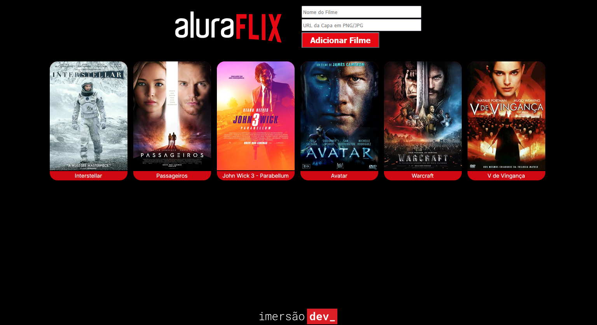

 

  <a href="https://imersao.dev/">
    
  </a> 
  
  

  
# 🎬 Aluraflix
O projeto permite que o usuário crie seu próprio catálogo temporário de filmes, adicionando o nome e a URL da imagem da capa.

## 🚀 Funcionalidades

- **Listagem de Filmes**: Exibe automaticamente uma lista de filmes pré-definidos ao carregar a página.
- **Adicionar Novos Filmes**: O usuário pode inserir o nome e o link de uma imagem (JPG ou PNG) para adicionar novos títulos à lista.
- **Validação de Dados**: 
  - Verifica se o campo de nome está vazio.
  - Valida se a URL da imagem termina em extensões suportadas (.jpg, .jpeg ou .png).
- **Alertas Personalizados**: Utiliza a biblioteca SweetAlert2 para exibir mensagens de erro ou sucesso de forma intuitiva.
 
  
## 💻 Como Visualizar

O projeto pode ser acessado diretamente através do GitHub Pages: 👉 https://raphaelsette.github.io/alura-flix/

## 📝 Referências

 - <a href="https://developer.mozilla.org/pt-BR/docs/Web/JavaScript/Guide/Expressions_and_operators" target="_blank">MDN - Operadores boleanos</a>
 - <a href="https://developer.mozilla.org/pt-BR/docs/Web/JavaScript/Reference/Global_Objects/parseFloat" target="_blank">MDN - parseFloat</a>
 - <a href="https://developer.mozilla.org/pt-BR/docs/Web/JavaScript/Guide/Grammar_and_types#vari%C3%A1veis" target="_blank">MDN - Sintaxe e Variáveis</a>
 - <a href="https://sweetalert2.github.io/" target="_blank">Documentação Sweetalert2</a>
 - <a href="https://developer.mozilla.org/pt-BR/docs/Web/JavaScript" target="_blank">Documentação JavaScript</a>
